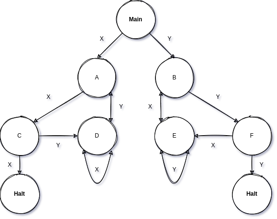

# Generate & Run State Machine

This program generates and runs a state machine, based on given input files.

### Future work:

- [ ] Remove _Main_ flag
- [ ] Add _Null_ flag (default fallthrough)
- [ ] Implement regex support for input tape

### Example (basic):

```json
{
    "CurrentState" : {
        "Input" : "NextState"
    }
}
```

### Example (tree-like):



Given this program text:
```json
{
  "Main" : {
    "X" : "A",
    "Y" : "B"
  },
  "A" : {
    "X" : "C",
    "Y" : "D"
  },
  "B" : {
    "X" : "E",
    "Y" : "F"
  },
  "C" : {
    "X" : "Halt",
    "Y" : "D"
  },
  "D" : {
    "X" : "D",
    "Y" : "A"
  },
  "E" : {
    "X" : "B",
    "Y" : "E"
  },
  "F" : {
    "X" : "E",
    "Y" : "Halt"
  }
}
```
And this program data: 
```
X X Y X Y X X
```
This program will produce the output:
```
Main : X => A
A : X => C
C : Y => D
D : X => D
D : Y => A
A : X => C
C : X => Halt
```
